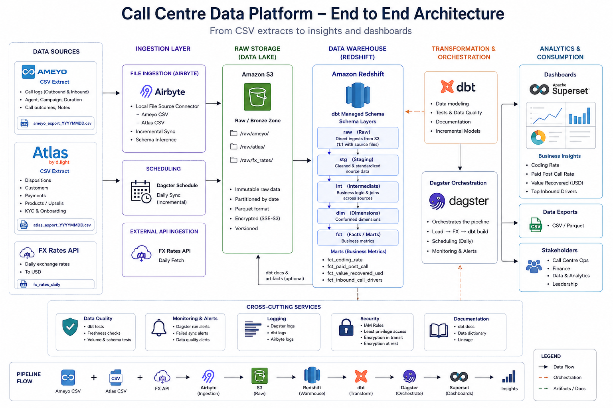

# Call Centre Data Platform

A production-shaped analytics pipeline for d.light's call centre.

Answers four measurement questions from two disconnected source systems (Ameyo, Atlas), re-runnable every morning against a new day of data, from ingestion through dashboards.

- **This README** covers what was built and how to run it end to end.
- **[WRITEUP DOCS](docs/WRITEUP.md)** is the case-study write-up - answers, data gaps(Please Click the link)
assumptions, how each gap was handled, recommendations.
- **[PROD DOCS](docs/PROD.md)** is the detailed, screenshot-illustrated production setup
(Redshift, S3, IAM, Airbyte).

---

## 1. Problem statement 

d.light sells solar home systems and appliances to off-grid, low-income households, mostly
pay-as-you-go where customers pay down the unit in small instalments over months. 

Keeping those customers paying is central to the business, and the call centre (Kenya, Uganda, Tanzania, Nigeria)
is one of the main levers: agents call to remind/encourage payment, complete KYC and onboarding,
upsell, run satisfaction surveys, and handle inbound enquiries and service requests.

**The problem:** two systems run the call centre, and they don't talk to each other.

- **Ameyo** - the telephony platform. Knows every call dialled, by which agent, on which campaign, for how long.
- **Atlas** - the CRM. After a call, the agent logs a *disposition* (what the call was about, how it went), and Atlas is also where customer payments are recorded.

The only link between the two is manual: Atlas generates a call-log id when a disposition is saved,
and the agent is expected to paste that id back into Ameyo's notes field by hand. Nothing enforces this happening - so the call centre team has had no reliable way to measure whether agents are actually doing it, or whether the calls are working.

### The four questions, answered

|   | Question | Result |
|---|---|---|
| 1 | Coding rate | **44.68%** (4,695 / 10,508 outbound calls) |
| 2 | Paid post call | **12.88%** (5,901 / 45,814 assessable dispositions) |
| 3 | Value recovered | $14,007USD (Kenya $6,576, Nigeria $2,920, Tanzania $2,970, Uganda $1,541) |
| 4 | Top inbound driver | **Enquiry** (3,851 of 7,679 inbound calls) |

Full reasoning, data-gap findings, and assumptions behind each of these numbers check: [WRITEUP](docs/WRITEUP.md).

---

## 2. System design overview




**Tools, and why each one:**

| Tool | Role |
|---|---|
| DuckDB | Local warehouse - zero cloud dependency, columnar/vectorized like Redshift |
| Amazon Redshift | Production warehouse |
| Amazon S3 | Landing zone for raw extracts + Airbyte's internal staging (production path) |
| Airbyte | S3 → Redshift ingestion connector (production path) |
| dbt | Transformation - staging → intermediate → marts, one layered project for both warehouses |
| Dagster | Orchestration - load → fetch FX → dbt build, as one job, either target |
| Apache Superset | Dashboards - connected to both warehouses simultaneously |
| Docker Compose | Runs Dagster + Superset as containers, locally or in production mode |

**The pipeline in one line:** both targets converge on the same dbt project -

```
raw (DuckDB file, or S3 --> Airbyte --> Redshift)
  --> staging (views)
  --> intermediate (incremental)
  --> marts (incremental; local = plain tables)
  --> Superset (queries either warehouse)
```

---

## 3. Data sources & ingestion

Four CSV extracts, one day at a time, dropped into `data/raw/{date}/`:

| File | What it is |
|---|---|
| `ameyo_outbound_calls.csv` | Every outbound call dialled, by agent/campaign |
| `atlas_calls_dispositions.csv` | Every logged disposition (outcome, direction, `call_type`) |
| `atlas_payments.csv` | Customer payments, local currency |
| `atlas_ameyo_mapping.csv` | The only bridge between the two systems' agent identities |

**Local target** 

- `ingestion/local_loader/load_raw.py` reads the CSVs directly into a DuckDB `raw` schema. 
- Drops and rebuilds every raw table on every run (delete the tables, run one command, get them back and a new date folder is picked up automatically, no code change.

**Production target**

- `ingestion/s3_upload/upload_to_s3.py` uploads the same files to S3; Airbyte's S3 source connector reads them (`incremental` sync mode) and writes to Redshift's `raw`
schema (`append` destination mode). 

Full setup: [PROD DOCS](docs/PROD.md).

**External FX-rate integration** - Metric 3 needs USD, and there's no rate in the source data, so
`ingestion/fx_rates/fetch_fx.py` calls [exchangerate-api.com](https://www.exchangerate-api.com/) once
per run and inserts the fetched rates into `raw.fx_rates` - a normal dbt source table, joined against
`atlas_payments` in staging to convert every payment to USD. 

The API integration is designed to handle:

- **Authentication** - the key is read from `EXCHANGERATE_API_KEY` (`.env`, gitignored), never
  committed to the repo.
- **Failure** - retries with backoff on `429`/`5xx`/connection errors (honouring the API's own
  `Retry-After` header on a 429), gives up after 5 attempts, fails immediately on a non-retryable
  `4xx`. Covered by 8 unit tests (`pytest ingestion/fx_rates/test_fetch_fx.py -v`) that mock the
  network entirely - no live API key needed to verify the retry logic.
- **Repeatability/Idempotency** - re-running against the same day deletes that day's existing
  `raw.fx_rates` rows before inserting the freshly-fetched ones, rather than appending a new set on
  top, so re-running the pipeline never duplicates the figures used for Metric 3.

Both paths keep raw data completely separate from anything transformed - nothing is cleaned,
deduped, or cast until the staging layer.

**Idempotency, proven, not just claimed** 

Re-running the production sync a second time with no new source data reports `0 rows` synced:


---

## 4. Storage

| | Local | Production |
|---|---|---|
| Warehouse | DuckDB (`warehouse_local.duckdb`, a file on disk) | Amazon Redshift Serverless |
| Schemas | `raw`, `staging`, `intermediate`, `marts` | same |
| Access model | Single file, single writer | 5 scoped identities - `airbyte_writer`, `dbt_user`, `superset_reader` (DB users) + `raw-data-ingestor`, `airbyte-s3-reader`, `airbyte-redshift-writer` (IAM), each least-privilege, each touching exactly one hop of the pipeline |

Every Redshift user/grant, with the reasoning for each, is in [`infra/redshift.sql`](infra/redshift.sql).


---

## 5. Transformation

One dbt project (`dbt/`), layered so the shape is the same on either warehouse:

- **staging** - light typing/renaming, views, one model per raw source.
- **intermediate** - the payment-attribution logic: each payment attributes to exactly one call
  (the nearest preceding disposition on the same contract, within a 3-day window) - needed because
  41% of paying contracts pay more than once, and a naive join would double-count value.
  `incremental`, 4-day lookback.
- **marts** - the four fact tables answering the four questions, plus `dim_agent`. `incremental`
  except `dim_agent` (a small full snapshot).

**The daily-refresh moving-window problem**

  *A call made Monday can't be assessed for paid-post-call until Thursday, because the 3-day payment window is still open. `fct_paid_post_call` carries an `is_window_closed` flag - false until the window has actually elapsed.
  **Metric 2's rate** is always computed over settled rows only, never a still-open window silently counted as "no."*

Full assumptions and the reasoning behind every modelling decision: [WRITEUP DOCS](docs/WRITEUP.md).

---

## 6. Visualization

Apache Superset, containerized, connected to **both** warehouses at once.

**Why Apache Superset?**
- Easy to build charts or run ad hoc SQL against either the local DuckDB file or production Redshift, same login.
- Low cost of running in a production environment.
- Wide range integration ecosystem with other data services.

**The Calls Centre Summary Dashboard**


---

## 7. Orchestration

Dagster runs the whole chain - `load_raw_data` → `load_fx_rates` → `run_dbt_build` - as one job,
for either target, natively or in Docker.


Every step was individually verified idempotent by actually re-running it: re-running the job
against unchanged data reports 0 new rows loaded and every downstream metric unchanged.

---

## 8. How to run

### a) Locally

**Prerequisites:** Python 3.12+. Nothing else - no Docker, no AWS account.

```bash
# 1. Set up the venv (from the repo root)
python -m venv venv
source venv/bin/activate        # Windows: venv\Scripts\activate

# 2. Install dependencies
pip install -r requirements.txt

# 3. Get a free exchange-rate API key from https://www.exchangerate-api.com/,
#    copy the env template, and fill it in
cp .env.example .env            # Windows: copy .env.example .env
#    edit .env: set EXCHANGERATE_API_KEY=<your key> (nothing else is needed for this path)

# 4. Start Dagster (DAGSTER_HOME set so the CLI and the UI share the same run
#    history -- without it, `dagster job launch` from another terminal fails
#    with DagsterHomeNotSetError even while `dagster dev` itself runs fine)
export DAGSTER_HOME="$(pwd)/dagster_project/.dagster_home"     # Windows (PowerShell): $env:DAGSTER_HOME="$PWD\dagster_project\.dagster_home"
dagster dev -f dagster_project/callhouse_dagster/definitions.py
```

1. Open **http://localhost:3000** → **Overview → Jobs → callhouse_pipeline** → **Launch Run** - or,
   from another terminal (same `DAGSTER_HOME` exported):
   `dagster job launch -f dagster_project/callhouse_dagster/definitions.py -j callhouse_pipeline`
2. **What you should see:** three steps run in sequence (`load_raw_data` → `load_fx_rates` →
   `run_dbt_build`). The run finishes green, and `warehouse_local.duckdb` now has the four metrics
   in its `marts` schema.
3. **Verify directly:**
   ```bash
   python3 -c "
   import duckdb
   con = duckdb.connect('warehouse_local.duckdb', read_only=True)
   print(con.execute('SELECT SUM(coded_calls), SUM(total_calls) FROM marts.fct_coding_rate').fetchall())
   "
   ```
4. **Deleting the tables and getting them back:** delete `warehouse_local.duckdb` (or just re-run
   the job - `load_raw.py` drops and rebuilds every raw table every run) and launch again.
   Re-running never duplicates data.
5. **Tomorrow's files, without editing anything:** both loaders glob `data/raw/*/`, so dropping a
   new `data/raw/2026-08-16/` folder next to the existing one and re-running is all that's needed.

**Running the three steps directly** (no Dagster, useful for understanding what's happening):
```bash
python ingestion/local_loader/load_raw.py
python ingestion/fx_rates/fetch_fx.py --target local
dbt build --project-dir dbt --profiles-dir dbt --target local
```

**Running the tests:**
```bash
pytest ingestion/fx_rates/test_fetch_fx.py -v   # 8 unit tests, no network, no credentials
dbt test --project-dir dbt --profiles-dir dbt --target local   # schema + singular tests
```
**What you should see:** all 8 FX unit tests pass, no network calls. `dbt build --target local`
finishes 23/23 (models + tests).

**Dashboards, local target:** `.env` needs two more values beyond `EXCHANGERATE_API_KEY`:
`SUPERSET_SECRET_KEY` 

generate with `python -c "import secrets; print(secrets.token_hex(32))"`)
and `SUPERSET_ADMIN_PASSWORD` (defaults to `admin`).  

Leave every `REDSHIFT_*`/`AIRBYTE_*`/`AWS_*`value blank - harmless for local-only use.

```bash
docker compose up superset --build
```
Open **http://localhost:8088**, log in with `admin` / your `SUPERSET_ADMIN_PASSWORD` - the
**Local (DuckDB)** connection is already configured and queryable.

### b) Production

**Prerequisites:**
- Docker (with the Compose plugin)
- An AWS account: Redshift Serverless workgroup, an S3 bucket, and 5 IAM/Redshift identities
  (`raw-data-ingestor`, `airbyte-s3-reader`, `airbyte-redshift-writer`, `dbt_user`,
  `superset_reader`) - grants for each in [`infra/redshift.sql`](infra/redshift.sql)
- At least ~15GB RAM free - Airbyte's local dev tooling (`abctl`) provisions a real Kubernetes
  cluster and pulls several GB of images on first install

```bash
cp .env.example .env
# fill in every value -- all of it is needed for this path
./tools/abctl local install --low-resource-mode         # 1. install Airbyte, http://localhost:8000
#   configure the S3 source + Redshift destination connectors + connection here --
#   full walkthrough with screenshots: docs/PROD.md
python ingestion/s3_upload/upload_to_s3.py               # 2. land data/raw/ in S3
DBT_TARGET=redshift docker compose up --build             # 3. Dagster + Superset, targeting Redshift
```

Open **http://localhost:3000**, launch `callhouse_pipeline` the same way as the local path.

**What you should see:** the same three-step run, taking noticeably longer on `load_raw_data`
(Airbyte's connector pods take real time to start) and on `run_dbt_build` (a live warehouse over
the network). 

Dashboards are already running - open **http://localhost:8088**

The **Production (Redshift)** connection is pre-configured, same login as the local path.

**A better way to run it:** `run.py` (repo root) wraps the abctl install + `docker compose up` into
one idempotent command:

```bash
python run.py up        # install/start everything
python run.py down      # stop containers, keep the Airbyte cluster + Superset's saved dashboards
python run.py destroy   # tear down everything (asks for confirmation)
```

**Full step-by-step production setup** (IAM users, Redshift grants, both Airbyte connectors, the
connection, Superset's dual-warehouse config - with screenshots of each): 

Check here: [PROD DOCS](docs/PROD.md).

---

## 9. Challenges

A handful of the more interesting ones - the full list of data gaps and how I handled each is in
[WRITEUP DOCS](docs/WRITEUP.md):

- **Two systems with no shared key.** Ameyo and Atlas only link through a manually-pasted id with a
  53% miss rate - the pipeline had to be designed around that gap, not just measure it.
- **Attributing payments without double-counting.** 41% of paying contracts pay more than once;
  designing a rule where one payment is never claimed by more than one call (but one call can
  legitimately be followed by more than one payment) took real thought, not just a date-range join.
- **The moving payment window.** A daily-refresh pipeline can't just report Monday's number and move
  on - it has to know which rows have actually settled (`is_window_closed`) versus which are still
  in flight.
- **DuckDB and Redshift don't agree on dialect or typing.** Reserved words, `regexp_replace`'s flag
  syntax, and Airbyte landing everything as `varchar` all surfaced only once the models were run
  against both real engines, not by reading the SQL.
- **Redshift's default-privilege grants are scoped per role, not per schema** - a role only inherits
  default access to tables created by the specific role that ran the grant, which is easy to get
  wrong and produces a confusing "connects fine, sees nothing" symptom.
- **True idempotency across composed systems.** Each script being individually idempotent wasn't
  enough - S3 always bumps `LastModified` on every upload, and Airbyte's incremental sync uses that
  as its cursor, so two idempotent components composed into a non-idempotent whole until the upload
  step got content-based (MD5) change detection.

---

## 10. New learnings

- **Idempotency is a property of the whole chain, not any one script.** Verifying each piece in
  isolation isn't sufficient - the S3/Airbyte interaction above only broke once ingestion, sync, and
  the destination's append mode were composed together.
- **Grantor-scoped privileges in a warehouse are a sharp edge worth knowing before, not after.**
  Redshift's `ALTER DEFAULT PRIVILEGES` binding to the role that runs it (not the schema) is exactly
  the kind of platform detail that only shows up by actually running a sync and checking table
  visibility per role.
- **A daily-refresh pipeline changes what "correct" means for a metric.** A number that's allowed to
  keep moving for three days needs an explicit signal for whether it's settled - designing for that
  from the start (rather than bolting it on) is what the brief was really testing.
- **Dashboard metrics need the same scrutiny as the SQL underneath them.** A BI tool's own
  aggregation choices (an unweighted `AVG` of a rate column, or a "last value" trend aggregation)
  can silently produce a different number than the warehouse actually computed - worth verifying a
  dashboard's numbers against the source of truth, not just trusting the chart.

---

## Repository layout

```
data/raw/{date}/*.csv     The four CSV source extracts
ingestion/
  local_loader/           DuckDB raw loader (local target)
  s3_upload/               S3 upload with content-based idempotency (production target)
  fx_rates/                Exchange-rate API integration + its own unit tests
  airbyte_sync/            Triggers + polls an Airbyte sync via its REST API
dbt/                      The `callhouse` dbt project -- staging -> intermediate -> marts
dagster_project/          Orchestration: load -> fetch FX -> dbt build, both targets
superset/                 Containerized Superset, both warehouses pre-configured
infra/redshift.sql        Every Redshift user/grant, with the "why" for each
docs/WRITEUP.md           The five-point case study write-up (answers, gaps, assumptions,
                          how handled, recommendations)
docs/PROD.md              Detailed, step-by-step production setup, with screenshots
run.py                    One-command environment manager (see How to run > Production)
```

