# Production Setup Guide

Full walkthrough for starting up the production path - Redshift, S3, IAM, Airbyte, Dagster,
Superset - from a blank AWS account. 

For the condensed quickstart see the README's [Production](../README.md#2-production-path) section. 

For why the pipeline is designed this way, see [WRITEUP DOCS](WRITEUP.md).

## Prerequisites

- An AWS account with permission to create IAM users, an S3 bucket, and a Redshift Serverless
  workgroup.
- Docker (with the Compose plugin).
- At least ~15GB RAM free and a reasonably fast connection - Airbyte's local dev tooling (`abctl`)
  provisions a real Kubernetes cluster (`kind`) and pulls several GB of container images on first
  install.
- `cp .env.example .env` and fill it in as you go through each step below - every value it asks for
  is produced by one of the steps in this guide.

---

## 1. S3 bucket

Create one bucket (e.g. `calls-raw-data`), no public access. Two prefixes inside it, used for two
different purposes:

- `raw/` - the landing zone. `upload_to_s3.py` writes the four source extracts here; Airbyte's S3
  source connector reads from here.
- `airbyte-staging/` - internal to Airbyte's Redshift destination connector. It re-serializes
  extracted records here before issuing a Redshift `COPY` from that prefix. Nothing else reads or
  writes this prefix.

Set `S3_RAW_BUCKET` in `.env`. Once `upload_to_s3.py` has run (step 8 below), the landing zone
looks like this:

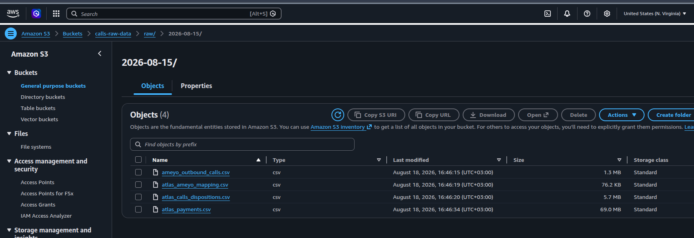

## 2. IAM users (one identity per hop, least privilege)

Three IAM users, each scoped to exactly one hop of the ingestion path - no identity is reused
across steps.

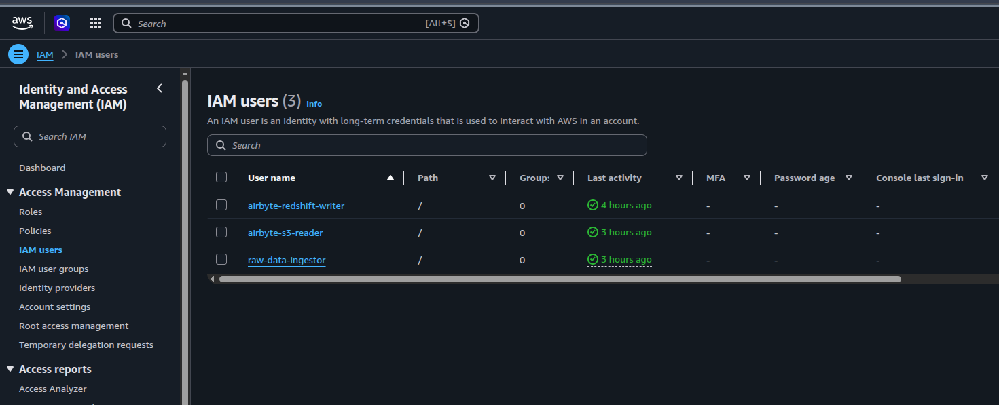

| Identity | Policy | Used by |
|---|---|---|
| `raw-data-ingestor` | `s3:PutObject` on `raw/*` | `ingestion/s3_upload/upload_to_s3.py` - represents an upstream system dropping files into the landing zone |
| `airbyte-s3-reader` | `s3:GetObject`, `s3:ListBucket` on `raw/*` | Airbyte's S3 **source** connector |
| `airbyte-redshift-writer` | `s3:PutObject`/`GetObject`/`DeleteObject`, `s3:AbortMultipartUpload`/`ListMultipartUploadParts` on `airbyte-staging/*`, `s3:ListBucket` scoped to that prefix, `s3:GetBucketLocation` | Airbyte's Redshift **destination** connector's internal staged-COPY mechanism - never touches `raw/` |

Generate an access key for each user and set the corresponding pair in `.env`
(`AWS_ACCESS_KEY_ID`/`SECRET` for `raw-data-ingestor`, `AIRBYTE_S3_*` for `airbyte-s3-reader`,
`AIRBYTE_REDSHIFT_*` for `airbyte-redshift-writer`).

## 3. Redshift Serverless

Create a Redshift Serverless workgroup + namespace. Note the endpoint host and set
`REDSHIFT_HOST`/`REDSHIFT_PORT` (5439)/`REDSHIFT_DATABASE` (`dev`) in `.env`.

Run [`infra/redshift.sql`](../infra/redshift.sql) once, as an admin user, against that database.
It creates:

- Four schemas: `raw`, `staging`, `intermediate`, `marts`.
- Three DB users, each scoped to what that role actually needs:
  - `airbyte_writer` - write access to `raw` only (plus `TEMP` and `CREATE` at the database level -
    Redshift's destination connector issues temp tables and an idempotent
    `CREATE SCHEMA IF NOT EXISTS` on every check/sync, both of which need database-level grants that
    schema-level grants alone don't cover).
  - `dbt_user` - read `raw`, full read/write on `staging`/`intermediate`/`marts`.
  - `superset_reader` - read-only across all four schemas.

**Note**: `ALTER DEFAULT PRIVILEGES` in Redshift is scoped to
whichever role *runs the statement*, not to the schema as a whole. A default-privileges rule you run
as an admin only covers tables that admin creates - it does **not** cover tables `airbyte_writer`
creates on its own syncs, or tables `dbt_user` creates on its own runs. `infra/redshift.sql` accounts
for this with `ALTER DEFAULT PRIVILEGES FOR USER <role> IN SCHEMA ... GRANT ...` - one rule per
schema, scoped to the specific role that actually populates it - plus a retroactive `GRANT ... ON ALL
TABLES` for anything created before the rule existed. Skipping this is the single most common way to
end up with `dbt_user` (or `superset_reader`) able to connect but seeing zero tables, even though the
schema-level grants look complete.

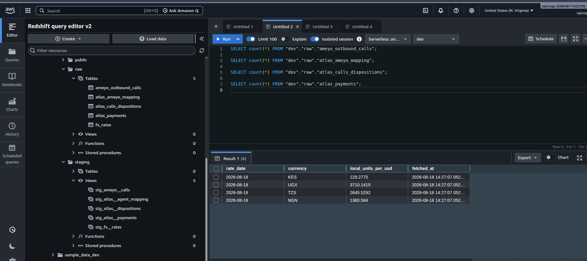

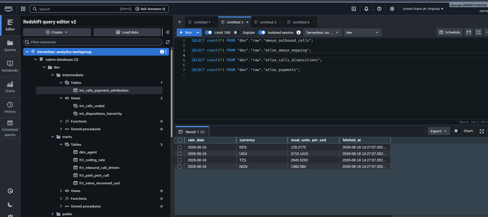

Set `REDSHIFT_AIRBYTE_USER`/`PASSWORD`, `REDSHIFT_DBT_USER`/`PASSWORD`,
`REDSHIFT_SUPERSET_USER`/`PASSWORD` in `.env` to match whatever passwords you set in the script.

## 4. Install Airbyte

```bash
./tools/abctl local install --low-resource-mode
```

(`run.py` and `tools/` fetch the right `abctl`/`abctl.exe` binary for your OS automatically - see
the README.) Verify at `http://localhost:8000`; get the generated login with
`./tools/abctl local credentials`, and set `AIRBYTE_LOGIN_EMAIL`/`PASSWORD` in `.env`.

`ingestion/airbyte_sync/` uses to trigger and poll syncs programmatically).

## 5. Airbyte: S3 source connector

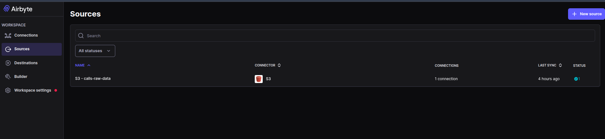

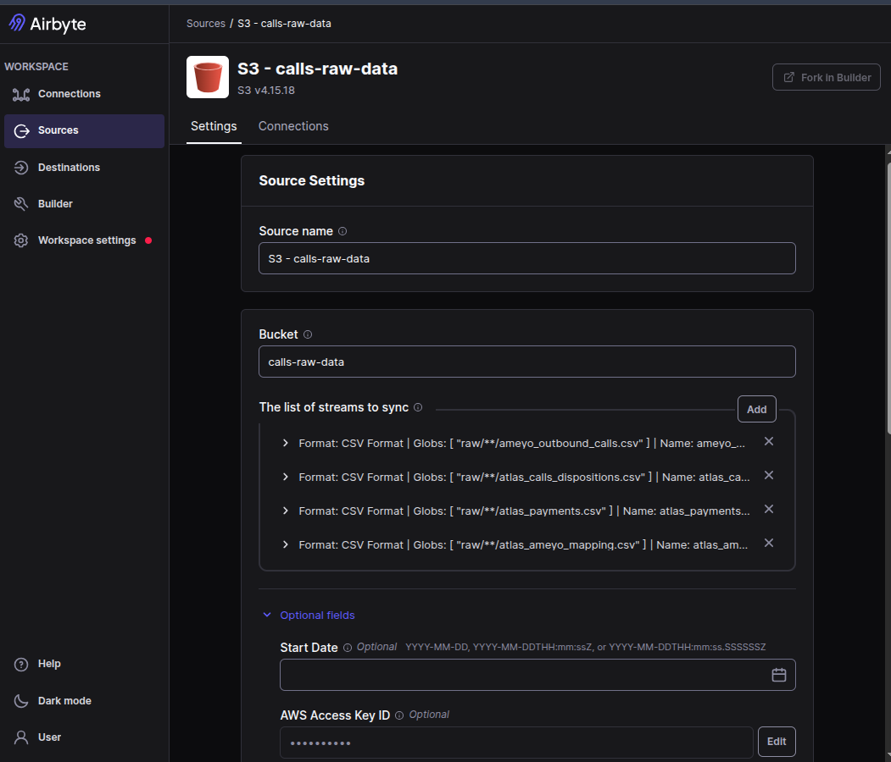

- Bucket: `S3_RAW_BUCKET`.
- One stream per entity, via glob `raw/**/{entity}.csv` (four streams: `ameyo_outbound_calls`,
  `atlas_calls_dispositions`, `atlas_payments`, `atlas_ameyo_mapping`).
- Credentials: `airbyte-s3-reader`'s access key/secret.

## 6. Airbyte: Redshift destination connector

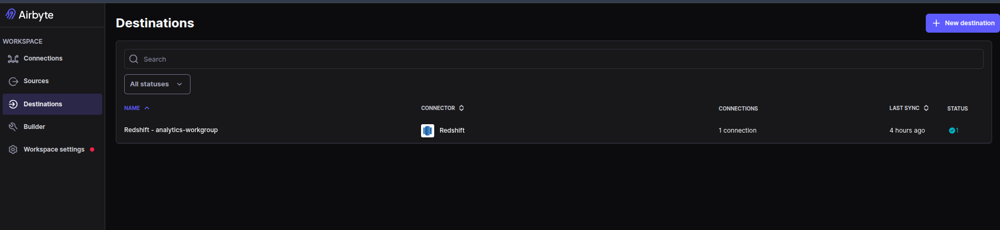

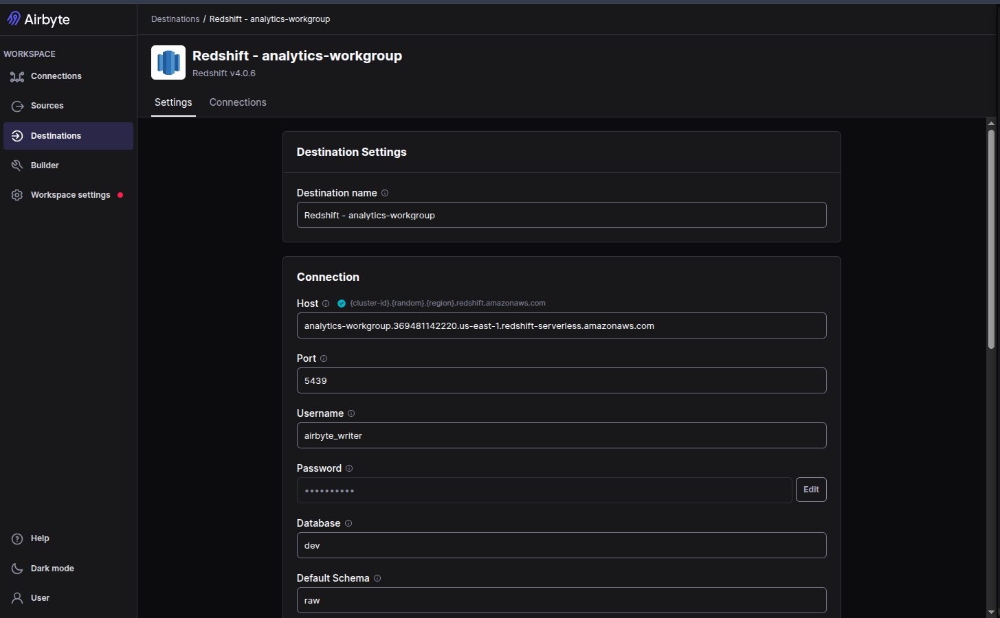

- Host/port/database: same Redshift Serverless endpoint as above.
- Schema: `raw`.
- DB user: `airbyte_writer`.
- S3 staging: `airbyte-redshift-writer`'s credentials, staging prefix `airbyte-staging/` in the same
  bucket.

## 7. Airbyte: connection

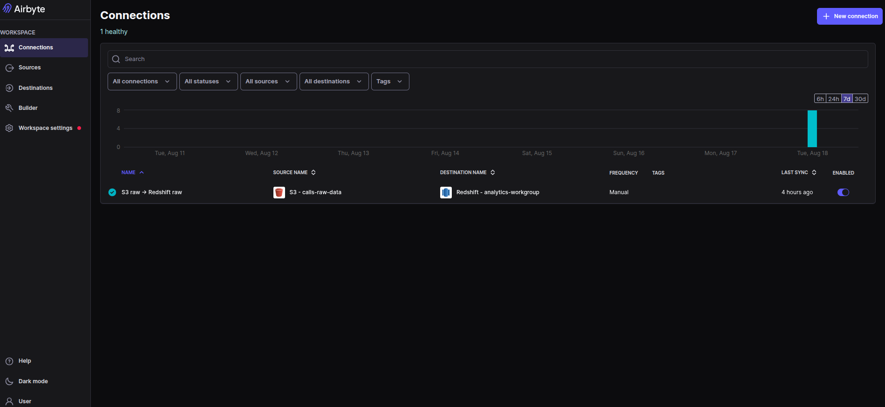

- Sync mode: **incremental** (source) / **append** (destination), per stream - not `full_refresh`,
  which would re-duplicate all historical data on every run. The incremental cursor is the S3
  object's `_ab_source_file_last_modified`.
- Set `AIRBYTE_CONNECTION_ID` in `.env` to this connection's id (visible in its URL in the Airbyte
  UI) - `ingestion/airbyte_sync/` needs it to trigger/poll the right connection.

**Note**: `upload_to_s3.py` re-uploads every file on every run but S3 always bumps `LastModified` on any
`PUT`, even an identical one. Since the Airbyte connection's incremental cursor *is*
`LastModified`, every upload run would make every file look "new" to Airbyte and trigger a full
re-read, which - combined with `append` destination mode - re-appends every row rather than skipping
it. `upload_to_s3.py` avoids this by comparing its own MD5 (stashed in the object's metadata on
upload) against what's already in S3 before uploading, and skipping the `PUT` entirely when content
is unchanged. (Not S3's own ETag - that's only a plain MD5 for single-part uploads, and
`atlas_payments.csv` at ~72MB is well over the multipart threshold.) This is what makes the sync
below actually idempotent, not just the upload script in isolation.

Verified back-to-back: first sync loaded 913,564 rows; the next sync (no new files) loaded 0.

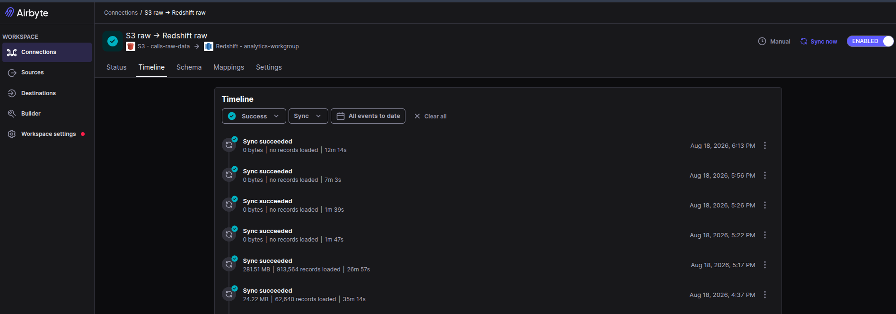

## 8. Dagster (orchestration)

```bash
python ingestion/s3_upload/upload_to_s3.py       # lands data/raw/ in S3
docker compose up --build                        # Dagster + Superset
```

Open `http://localhost:3000`, launch `callhouse_pipeline` -- in the Launchpad's run config, set
`resources.target_resource.config.target` to `redshift` (defaults to `local`). `load_raw_data` then
uploads to S3 and triggers/polls the Airbyte sync instead of loading DuckDB directly; `load_fx_rates`
and `run_dbt_build` are unchanged from the local path, just pointed at Redshift. The daily 06:00
schedule (`callhouse_daily_schedule`) always runs against `redshift`, regardless of what a manual
Launchpad run picks.

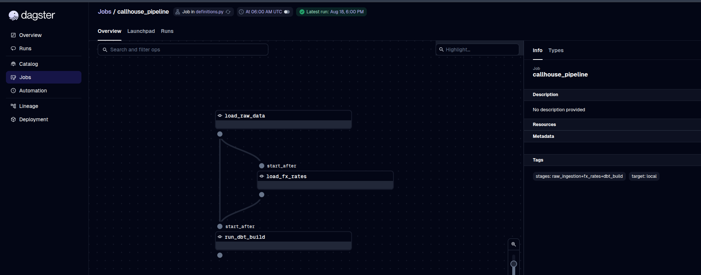

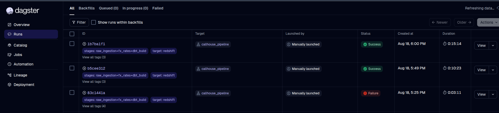

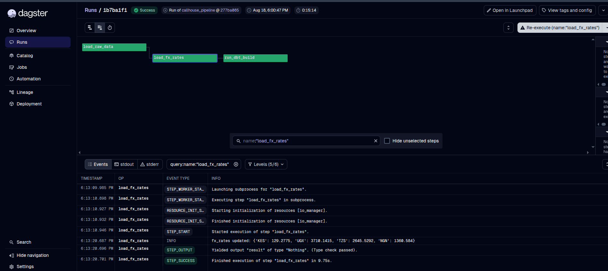

**Redshift-specific dbt notes**, if adapting these models for a different warehouse: Airbyte lands
every raw column as `varchar` (no schema inference on the S3 source), so arithmetic/`COALESCE` on
numeric or timestamp columns needs an explicit cast at the staging layer, not just DuckDB's implicit
type inference. `raw` is a reserved word in Redshift and needs quoting. `regexp_replace`'s
global-match syntax differs (Postgres/DuckDB take a `'g'` flag; Redshift's fourth argument is a
position, and Redshift already replaces every match by default).

## 9. Superset (dual warehouse)

Already running from step 8 (`docker compose up` starts both services). Open
`http://localhost:8088`, log in with `admin`/`SUPERSET_ADMIN_PASSWORD`.

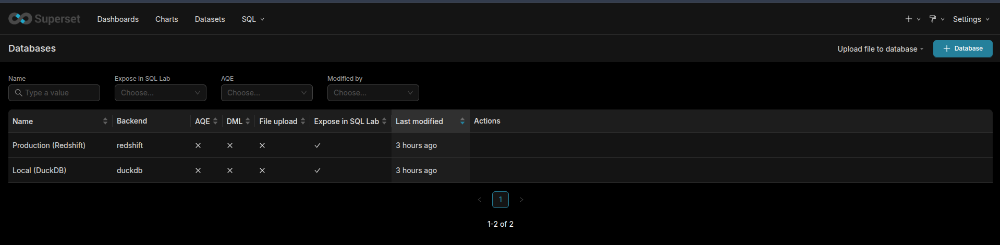

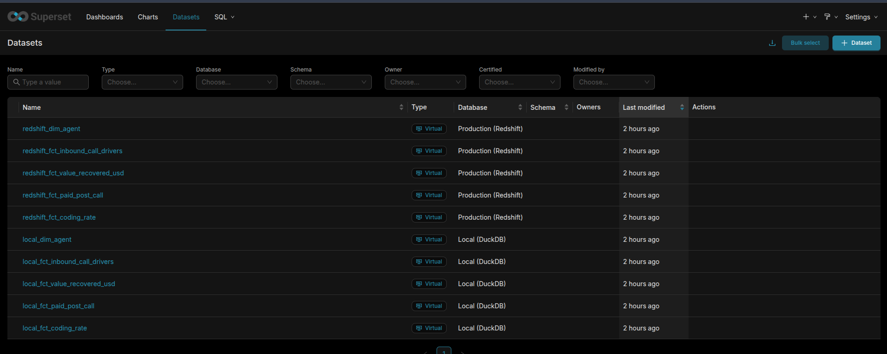

Both the **Local (DuckDB)** and **Production (Redshift)** connections, and all five marts as
datasets on each, are created automatically on container startup (`superset/bootstrap.py`) - nothing
to configure by hand.

The dashboard/charts below are also pre-loaded automatically, on a first-time startup only -
`bootstrap.py` imports `superset/exports/dashboard_export.zip` the first time it finds no dashboard
with that title, and skips the import on every later restart so it never overwrites edits made in
the UI since. To ship an updated version of the dashboard, export it again from Superset
(**Dashboards -> Export**) and overwrite that same ZIP.

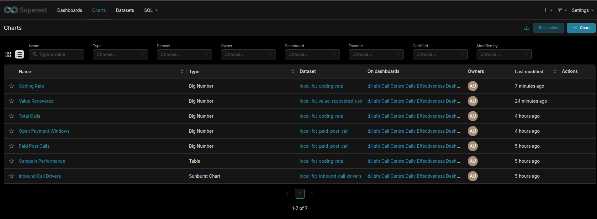

**The Dashboard**

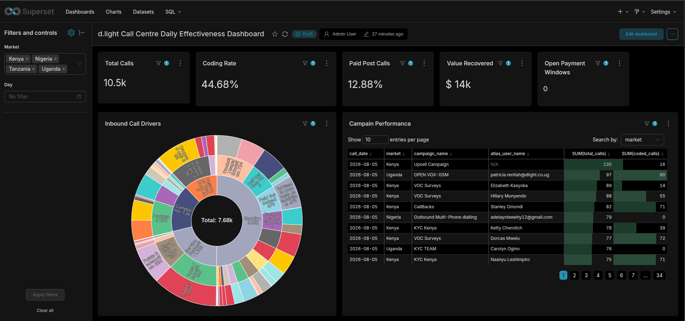

**If you're standing up Superset's Redshift driver yourself**: install the driver packages
(`sqlalchemy-redshift`, `redshift_connector`) into Superset's own `uv`-managed venv, not the image's
system Python - Superset's server runs from that venv and won't see a plain `pip install`. 

Pin `sqlalchemy<2`; `sqlalchemy-redshift`'s latest release pulls in SQLAlchemy 2.0, which breaks
Superset's own startup. 

`superset_reader` needs the same grantor-scoped `ALTER DEFAULT PRIVILEGES`
treatment as `dbt_user` in step 3 to see `marts.*` 

---

## Troubleshooting reference

| Symptom | Cause | Fix |
|---|---|---|
| `dbt_user` or `superset_reader` connects fine but sees zero tables in a schema | `ALTER DEFAULT PRIVILEGES` only covers tables created by whoever *runs* the grant, not tables another role creates | Grantor-scoped rule: `ALTER DEFAULT PRIVILEGES FOR USER <creator> IN SCHEMA ... GRANT ...`, plus a retroactive `GRANT` for existing tables |
| Airbyte's Redshift destination check/sync fails with `permission denied for database dev` | Redshift checks database-level `TEMP`/`CREATE` before schema-level grants are consulted for temp tables / `CREATE SCHEMA IF NOT EXISTS` | `GRANT TEMP, CREATE ON DATABASE dev TO airbyte_writer` |
| Every pipeline run re-appends all rows, even with no new source data | S3 bumps `LastModified` on every `PUT`, and Airbyte's incremental cursor is `LastModified` | Upload script skips the `PUT` when content (own MD5, not S3's ETag) is unchanged |
| `dbt build --target redshift` fails on numeric/timestamp columns | Airbyte lands all raw columns as `varchar`; DuckDB's implicit typing doesn't apply | Cast explicitly in staging models |
| `syntax error at or near "raw"` | `raw` is a Redshift reserved word | Quote it: `"raw"` |
| Superset query fails with `Can't load plugin: sqlalchemy.dialects:duckdb` (or similar) | Driver installed into the image's system Python, not Superset's own venv | `uv pip install --python /app/.venv/bin/python ...` |
| Superset container won't start after adding the Redshift driver | Latest `sqlalchemy-redshift` pulls in SQLAlchemy 2.0, incompatible with this Superset version | Pin `sqlalchemy<2` |

---

## Next steps

In a long-lived production platform I would also consider adding the following


- **Scheduling.** Runs are launched by hand today. Production would run `callhouse_pipeline` on a
  Dagster schedule/sensor (e.g. daily at a fixed UTC hour), not via manual "Launch Run."
- **Alerting.** No failure notification exists yet - a failed run is only visible if someone opens
  the Dagster UI. Production needs a Slack/email/PagerDuty hook on run failure, plus a check on the
 
- **Secrets management.** Credentials live in a gitignored `.env` file, fine for a single-operator
  local setup. Production would pull these from AWS Secrets Manager or Parameter Store, with IAM
  roles (temporary, assumed credentials) replacing the long-lived access keys used here.
- **CI/CD for the pipeline itself.** The current GitHub Actions workflow runs the local target only.
  A real deployment pipeline would run `dbt build --target redshift` (or a slim/state-based CI) and
  deploy the Dagster/Superset images on merge, not just validate locally.
- **Redshift operations.** No `VACUUM`/`ANALYZE` schedule, workload management, or cost controls
  (e.g. auto-pause) are configured - needed once this runs continuously rather than for a demo.
- **Data catalog / lineage.** `dbt docs generate` isn't hosted anywhere yet; production would publish
  it (or a catalog tool) so "what does one row represent" is discoverable without reading the repo.
- **Monitoring.** No metrics/logs pipeline exists beyond each service's own console output -
  production would ship Dagster run/step metrics, Redshift query performance, and Superset request
  latency to something like CloudWatch or Prometheus/Grafana, with dashboards and alert thresholds
  on top rather than someone noticing a problem by eye.
- **Kubernetes deployment.** Dagster and Superset run as two `docker compose` containers on one
  machine here; production would deploy both to a real Kubernetes cluster (EKS) instead - a
  Deployment + Service per component, Dagster's own [Kubernetes
  executor](https://docs.dagster.io/deployment/execution/executors) so each pipeline step runs as
  its own pod (real isolation and horizontal scaling, not one shared container), Secrets/ConfigMaps
  replacing `.env`, and a persistent volume claim (or moving Superset's metadata to a managed
  Postgres) in place of the local named volume. Airbyte itself already runs on Kubernetes via
  `abctl` in this setup (a local `kind` cluster) - the production equivalent is Airbyte's own Helm
  chart against the same EKS cluster, rather than a separate local-only cluster per developer.
